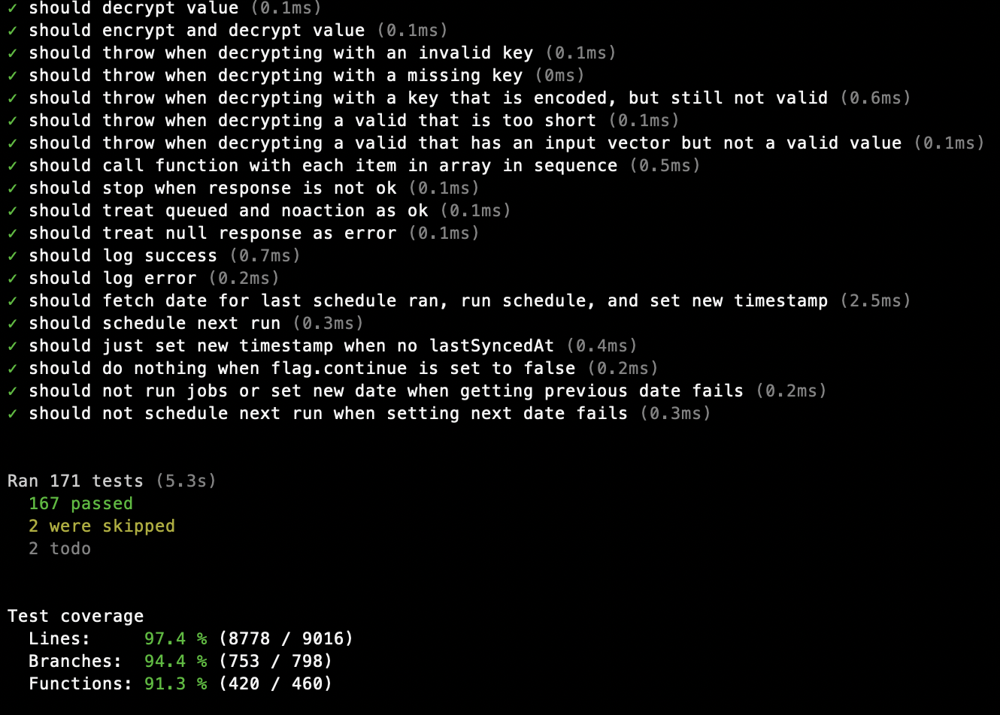

# Test reporter for the node test runner

[](https://www.npmjs.com/package/node-test-reporter)

This is a test reporter for the built-in node test runner, providing a cleaner
output inspired in particular by the [Ava](https://github.com/avajs/ava) test
runner.

The reporter will list all tests as they run, with a running count of the total
number of tests started and how many passed or failed. When done, we print all
diagnostic messages, errors, and a summary. If code coverage is enabled, we
print a summary of the coverage percentages too. (See [note below](#coverage) on
coverage in node v20.)



The node test runner was introduced in node v18. This reporter is tested with
node v20, v22, and v24, but should work in other versions too.

> [!NOTE]
> We flip the meaning of plus and minus signs when showing diffs in the output,
> to match the convention of some other test runners. This is probably a matter
> of taste, and if you prefer the way node test runner does it by default, this
> may not be the right reporter for you.

## Installing and using

```
npm install node-test-reporter -D
```

To run your tests:

```
node --test --test-reporter node-test-reporter 'src/**/*.test.js'
```

This is best run as a script in your `package.json`:

```
"scripts": {
  ...
  "test": "node --test --test-reporter node-test-reporter 'src/**/*.test.js'"
  ...
}
```

> [!NOTE]
> We use `'src/**/*.test.js'` here to include all files ending with `.test.js`
> below the `src` folder. The `**` glob have only worked like this since node
> v21, and only when surrounded by quotes. This was a breaking change in node.
> For older versions, you may use `src` (without quotes) instead. See
> [this disussion](https://github.com/nodejs/node/issues/50287) for more.

## TypeScript

To run TypeScript tests, install e.g. the [tsx](https://github.com/privatenumber/tsx)
package and run your tests like this:

```
node --import tsx --test --enable-source-maps --test-reporter node-test-reporter 'src/**/*.test.ts'
```

By enabling source maps with `--enable-source-maps`, you'll get the correct
line and column numbers for your `.ts` files.

## Tests that hang

It's possible to get the node test runner to hang. When a test or a tests suit
starts a http server, an interval or a timer, the test runner will not exit
until the server is closed, the interval is cleared, or the timer is cleared. If
your test fails without the proper clean up, the test will never end.

Since `node-test-reporter` will not list errors until all tests has ended, you
will not know which test failed. Because of this, we will now list errors when
five seconds pass without any tests starting or stopping. This will not
identify the test that causes the hang, but you will at least be able to see
which tests failed and _may_ be causing the hang.

## Coverage

Code coverage is still experimental in node v22, but may be included like this:

```
node --test --experimental-test-coverage --test-reporter node-test-reporter 'src/**/*.test.js'
```

> [!NOTE]
> The experimental test covarge is available from node v18, but has a bug in v20
> where it will throw an error in some instances. We recommend using v22 for
> coverage. See [this discusson](https://github.com/nodejs/node/issues/51552)
> for more.

## Running the tests

```
npm test
```

## Contributing

Please read
[CONTRIBUTING](https://github.com/integreat-io/node-test-reporter/blob/master/CONTRIBUTING.md)
for details on our code of conduct, and the process for submitting pull
requests.

## License

This project is licensed under the ISC License - see the
[LICENSE](https://github.com/integreat-io/node-test-reporter/blob/master/LICENSE)
file for details.
